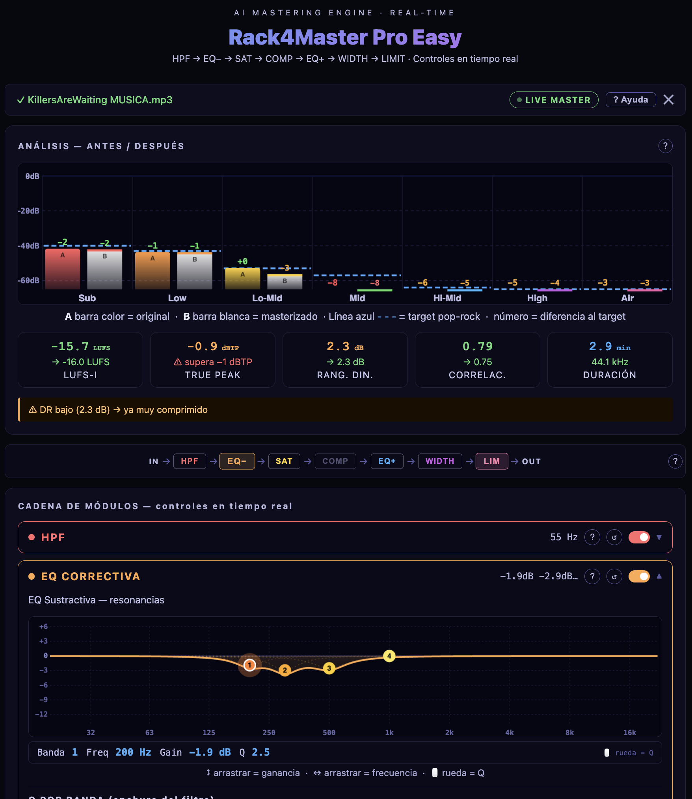
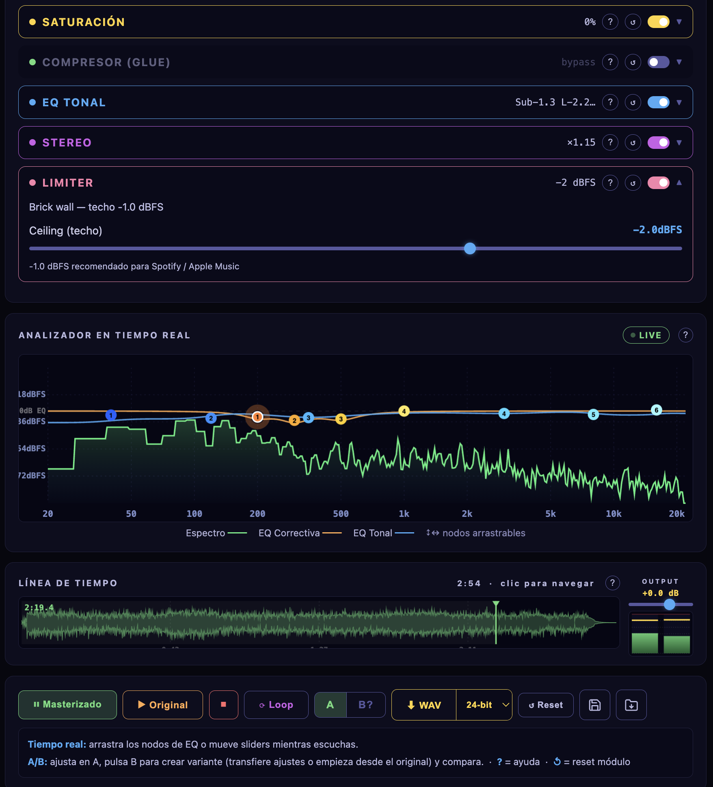

# Rack4Master Pro Easy — AI Mastering Engine

## ✨ Características principales

- **Cadena profesional fija** (HPF → EQ Correctiva → Saturación → Bus Comp → EQ Tonal → Stereo Width → Limiter → Output Gain).
- **Auto‑análisis inteligente** — promedia 15 snapshots FFT distribuidos por los primeros 40 segundos del track, compara el balance espectral relativo con la forma típica del pop‑rock comercial y calcula ajustes iniciales para cada módulo.
- **Auto‑correcciones automáticas** — el análisis no solo detecta problemas, los corrige: ajusta el HPF según el contenido sub, suaviza o desactiva el compresor si el DR ya es muy bajo, fija el Ceiling del limitador según el True Peak del original, y reduce la saturación si la mezcla ya está muy limitada.
- **EQ Correctiva de 4 bandas** — filtros peak arrastrables centrados en 200 / 300 / 500 / 1000 Hz con Q y ganancia ajustables. Diseñada para cortes quirúrgicos en la zona de mud (200–1000 Hz) antes del compresor.
- **EQ Tonal de 7 bandas** — cubre el mismo espectro que el análisis inicial: Sub shelf (40 Hz), Low shelf (120 Hz), Lo‑Mid peak (350 Hz, arrastrable), Mid peak (1 kHz, arrastrable), Hi‑Mid peak (3 kHz, arrastrable), High shelf (8 kHz), Air shelf (16 kHz).
- **Métricas de calidad** — LUFS‑I (ITU‑R BS.1770‑4), True Peak con interpolación cúbica 4× calculado sobre original y master, Rango Dinámico, Correlación estéreo.
- **Control en tiempo real** — todos los sliders y conmutadores actúan al instante mientras escuchas.
- **Comparación A/B de variantes** — dos slots de ajustes (A y B) para crear y comparar dos versiones distintas del master. Cambio de slot sin perder posición de reproducción.
- **Loop arrastrable** — define una región de bucle en la waveform y repite la sección indefinidamente, en modo original o masterizado.
- **Analizador en tiempo real** — espectro FFT superpuesto con las curvas de EQ Correctiva y EQ Tonal. **Arrastra los nodos EQ directamente sobre el gráfico** para modificar frecuencia y ganancia al instante.
- **Output Gain post‑limitador** — trim de salida que se bake en el WAV exportado sin afectar al comportamiento del limitador.
- **VU Meter estéreo** — barras RMS con peak hold de 2 segundos.
- **Presets** — guarda y carga tu configuración completa (archivo `.mpreset`).
- **Exportación WAV** — elige 24‑bit (profesional) o 16‑bit (distribución directa) con dithering TPDF para 16‑bit.

## 🖥️ Capturas de pantalla

| Análisis espectral | Cadena de masterización |
|--------------------|--------------------------|
|  |  |

## 🚀 Uso rápido

1. Arrastra un archivo de audio (MP3, WAV, FLAC, AAC, OGG, M4A) o haz clic para cargarlo.
2. Espera el análisis automático (10–30 segundos según duración). El auto‑análisis calcula ajustes y aplica correcciones preventivas.
3. Pulsa **▶ Masterizado** para escuchar el resultado con los ajustes calculados.
4. Ajusta los sliders o arrastra los nodos EQ en el analizador en tiempo real.
5. Usa **⟳ Loop** para aislar una sección, **A / B** para comparar dos variantes del master, y **▶ Original** para evaluar el punto de partida.
6. Guarda el preset (💾) y exporta el master (⬇ WAV).

## 🎛️ La cadena de procesado

```
IN → HPF → EQ Correctiva (4 bandas) → Saturación → Bus Comp → EQ Tonal (7 bandas) → Stereo Width → Limiter → Out Gain → OUT
```

| Módulo | Tipo | Función |
|--------|------|---------|
| HPF | High‑pass 12 dB/oct | Elimina subsónico (auto: 22–55 Hz según contenido sub) |
| EQ Correctiva | 4× peaking Q‑adjustable | Cortes quirúrgicos de mud en 200 / 300 / 500 / 1000 Hz |
| Saturación | Waveshaper tanh | Calidez analógica, densidad espectral |
| Bus Comp | DynamicsCompressor | Glue estéreo (auto‑bypass si DR < 3 dB) |
| EQ Tonal | 2 shelves + 3 peaks + 2 shelves | Moldeo espectral de carácter (7 bandas = 7 zonas del análisis) |
| Stereo Width | Matriz M/S | Control de amplitud estéreo |
| Limiter | Ratio 20:1, ataque 1 ms | Ceiling auto‑ajustado según True Peak del original |
| Output Gain | Ganancia lineal | Trim final post‑limitador |

## 🗺️ Mapa de frecuencias

| Zona | Rango | Módulo | Default |
|------|-------|--------|---------|
| Sub | 20–80 Hz | HPF + EQ Tonal Sub | Shelf 40 Hz |
| Low | 80–250 Hz | EQ Correctiva + EQ Tonal Low | Shelf 120 Hz / Peak 200 Hz |
| Lo‑Mid (mud) | 250–500 Hz | EQ Correctiva + EQ Tonal Lo‑Mid | Peak 300 Hz / Peak 350 Hz |
| Mid | 500–2000 Hz | EQ Correctiva + EQ Tonal Mid | Peak 1 kHz |
| Hi‑Mid | 2–8 kHz | EQ Tonal Hi‑Mid | Peak 3 kHz |
| High | 8–16 kHz | EQ Tonal High | Shelf 8 kHz |
| Air | 16–22 kHz | EQ Tonal Air | Shelf 16 kHz |

## 🛠️ Tecnologías

- **Web Audio API** — procesado en tiempo real y renderizado offline sin servidores.
- **OfflineAudioContext con múltiples suspensions** — análisis FFT promediado (15 snapshots) y exportación de alta calidad.
- **Canvas API** — espectro, waveform, curvas EQ, VU meter (todas a 60 fps).
- **JavaScript puro (ES2020)** — sin frameworks ni dependencias externas.
